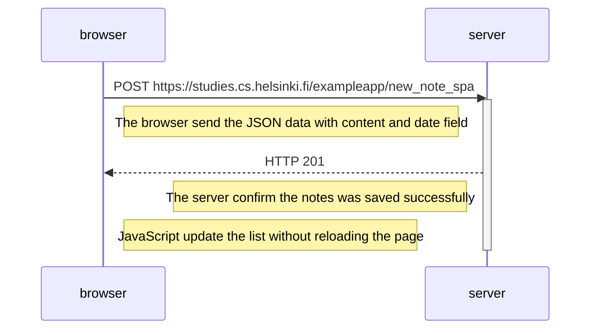

```mermaid
    sequenceDiagram
        participant browser
        participant server

       browser->>server: POST https://studies.cs.helsinki.fi/exampleapp/new_note_spa
       activate server

       Note right of browser: The browser send the JSON data with content and date field
       
       server-->>browser: HTTP 201

       Note left of server: The server confirm the notes was saved successfully

       Note right of browser: JavaScript update the list without reloading the page

       deactivate server
```